# Mini Projet Docker (students list)
<div align="center">
  
</div>

#
Ce projet a été réalisé dans le cadre de mon parcous Devops au BootCamp n°15 de **EAZYTraining** avec [Dirane Tafen](https://github.com/diranetafen/).

## Objectifs
Les objectifs de cet examen pratique sont de garantir que vous êtes capable de gérer une infrastructure **Docker**.

Vous serez donc évalué sur les points suivants.


- Améliorer un processus de déploiement d'applications existant
- Versionner la release de l' infrastructure
- Aborder les meilleures pratiques lors de la mise en œuvre de l'infrastructure **Docker**
- Infrastructure en tant que code
- Mettre en place un Registre privé
## Context

**POZOS** est une société informatique située en France et développe des logiciels pour les lycées.
Le département de l'innovation souhaite perturber l'infrastructure existante pour garantir qu'il peut être évolutif, facilement déployé avec un maximum d’automatisation.

**POZOS** souhaite que vous créiez un POC pour montrer comment **Docker** peut  aider et à quel point cette technologie est efficace.

Pour ce POC, **POZOS** vous fournira une application et souhaite que vous construisiez une infrastructure de « découplement » basée sur **Docker**.

Actuellement, l'application s'exécute sur un seul serveur sans évolutivité et sans haute disponibilité.

Lorsque **POZOS** a besoin de déployer une nouvelle version, à chaque fois, quelque chose tourne mal.

En conclusion, **POZOS** a besoin d'agilité sur sa ferme logicielle.
## Infrastructure

Pour ce POC, vous n’utiliserez qu’une seule machine sur laquelle Docker sera installé.

Le Build et le Déploiement se feront sur cette machine.

POZOS vous recommande d'utiliser le système d'exploitation **centos7.6** car c'est le plus utilisé dans l'entreprise.


## Application

L'application sur laquelle vous allez travailler s'appelle *"student_list"*, cette application est très basique et permet à POZOS d'afficher la liste des étudiants avec leur âge.

*student_list* comporte deux modules :

Le premier module est une **API REST** (avec authentification de base requise) qui envoie la liste de souhaits de l'étudiant basée sur un fichier JSON

Le deuxième module est une application web écrite en **HTML + PHP** qui permet à l'utilisateur final d'obtenir une liste d'étudiants.

Votre travail consiste à créer un conteneur pour chaque module et à les faire interagir les uns avec les autres.

Le code source de l'application peut être trouvé [ici](https://github.com/diranetafen/student-list.git)

Les fichiers que vous devez fournir (dans votre livraison) sont le **Dockerfile** et un **docker-compose.yml** 

### Rôles des différents fichiers :

**student_age.json** : contient le nom des étudiants avec leur âge au format JSON
**student_age.py** : contient le code source de l'API en python  
**index.php** : la page PHP où l'utilisateur final sera connecté pour interagir avec le service afin de - lister les étudiants avec leur âge. Vous devez mettre à jour la ligne suivante avant d'exécuter le conteneur de site Web pour adapter api_ip_or_name et port

voici l'url : $url = 'http://<api_ip_or_name:port>/pozos/api/v1.0/get_student_ages';
## Travail à Faire

Mon travail consiste à :

- 1 - Provisionner une VM avec Centos7.6 comme OS
- 2 - Installer Docker et Docker-compose sur la VM
- 3 - Produire le Dockerfile 
- 4 - Builder & Tester les images
- 5 - Créer des conteneurs et les faire interagir les uns avec les autres 
- 6 - Produire le docker-compose (**IAC**)
- 7 - Fournir un registre privé pour stocker les images


### Étapes 1 & 2 (*Provisionner une VM avec Centos7.6 comme OS*)

Pour provisionner la VM j'ai opté pour **VirtualBox et Vagrant** pour automatiser le deploiement de la VM et l'installation de **Docker et docker-compose** (étape 1 & 2)

### Étapes 3: *Production des Dockerfiles*
voici ci-dessous les Dockerfiles qui va permet de faire le build des images.

**API Dockerfile**
```
FROM python:2.7-buster
LABEL MAINTAINER "GBANE Assouman (gbane.assouman@gmail.com)"
WORKDIR /
COPY ./student_age.py .
RUN apt update -y && apt install python-dev python3-dev libsasl2-dev python-dev libldap2-dev libssl-dev -y
RUN pip install  flask==1.1.2 flask_httpauth==4.1.0 flask_simpleldap python-dotenv==0.14.0
EXPOSE 5000
CMD ["python","./student_age.py"]
```

- <strong>Image de base</strong><br/>
FROM nginx:latest<br/>
- <strong>Responsable</strong><br/>
LABEL maintainer="GBANE Assouman gbane.assouman@gmail.com"

- <strong>Répertoire de stockage de l'API</strong><br/>
WORKDIR /

- <strong>Copie des fichiers dans le répertoire WORKDIR</strong><br/>
COPY . .

- <strong>Installation des dépendances </strong><br/>
RUN apt update -y && apt install python-dev python3-dev libsasl2-dev python-dev libldap2-dev libssl-dev -y

RUN pip install  flask==1.1.2 flask_httpauth==4.1.0 flask_simpleldap python-dotenv==0.14.0

- <strong>Port d'écoute de l'API </strong><br/>
EXPOSE 5000

- <strong>Démarrage de l'API</strong><br/>
CMD ["python","./student_age.py"]

### Étapes 4: *Build & Test des images*

**Build de l'image de l'API**
```
cd student-list/simple_api/
docker build -t api-student-list .
docker images
```

<div>
  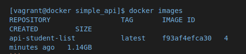
</div><br/>


**Création d'un réseau**

Afin d'assurer une meilleure isolation des conteneurs et permettre la résolution DNS par leur nom on va créer un reséau dedié de type **Bridge**

```
docker network create --driver=bridge api-network
docker network ls
```

<div>
  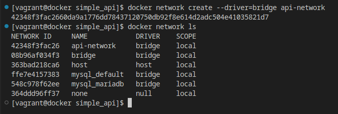
</div><br/>


### 5 - Création des conteneurs

Afin de rendre persistent le fichier student_age.json dans le conteneur, nous allons le monter dans le répertoire /data/ à l'intérieur de ce dernier.
```
docker run --name student-api -d -p 5000:5000 --network=api-network -v ./student_age.json:/data/student_age.json api-student-list
docker ps -a
```
<div>
  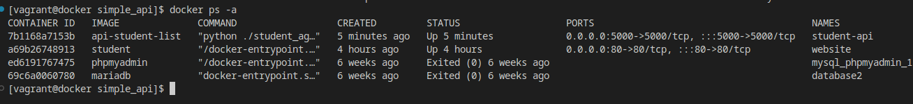
</div><br/>

**Build de l'IHM (HTML & PHP)**

Pour que Nous allons modifier dans le fichier *index.php* la ligne contenant l'url d'appel de l'API: 
$url = 'http://<api_ip_or_name:port>/pozos/api/v1.0/get_student_ages'; en remplaçant : 

***<api_ip_or_name:port>*** par ***student-api:5000***
```
sed -i 's/<api_ip_or_name:port>/student-api:5000/g' ./website/index.php
```
<div>
  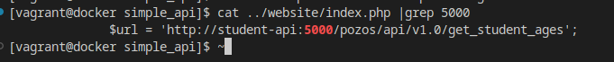
</div><br/>

```
cd website

docker run --rm -d --name=webapp -p 80:80 --network=api-network -v ./website/:/var/www/html -e USERNAME=toto -e PASSWORD=python php:apache

docker ps -a
```
<div>
  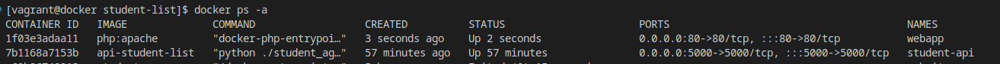
</div><br/>

**Test des conteneurs**
```
docker exec webapp curl -u toto:python -X GET http://student-api:5000/pozos/api/v1.0/get_student_ages
```
<div>
  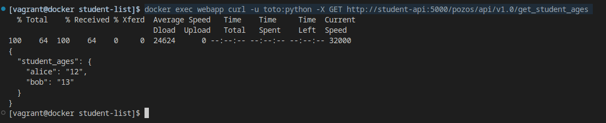
</div><br/>

```
docker stop student-api webapp
docker rm student-api webapp
docker network rm api-network
```

### 6 -  Mise en place du docker-compose pour le Déploiement
**1 - Production du docker-compose.yml**

Notre **docker-compose** comportera les sections suivantes:
- **services** *website pour l'IHM et api pour l'API*
  - le paramètre **depends_on** permet de lancer l'API avant l'IHM
  - dans les bonnes pratiques on choisira le paramètre **env_file** à la place de **environment** pour stocker des informations sensibles dans un fichier nommé **.env**
  - pour des raisons de sécurité on va optimiser l'API pour qu'il n'écoute que sur 127.0.0.1 dans la partie port en remplaçant **5000:5000** par **127.0.0.1:5000:5000**
- **volumes** *de type bind pour monter les répertoires des deux services*
- **network** *pour créer un réseau dedié aux deux services*


```
version: "2.2"
services:
  website:
    container_name: webapp
    image: php:apache
    depends_on:
      - api
    env_file:
      - .env
    ports:
     - 80:80
    volumes:
     - ./website:/var/www/html 
    networks:
    - api-network

  api:
   container_name: student-api
   image: api-student-list:latest
   ports:
    - 127.0.0.1:5000:5000
   volumes:
    - ./data/student_age.json:/data/student_age.json
   networks:
    - api-network

volumes:
  data:

networks:
  api-network:
    name: api-network
    driver: bridge
```
**2 - Déploiement des conteneurs**

Pour déployer les conteneurs il faut se deplacer dans le même répertoire que notre docker-compose.yml et saisir la commande ci-dessous en mode détaché avec l'option **-d**
```
docker-compose up -d
docker-compose ps
```
<div>
  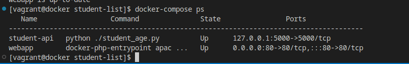

</div><br/>

**3 - Test**

Pour récuperer de l'adresse Ip du serveur on tape la commande ci-dessous 

```
ifconfig eth1
```
<div>
  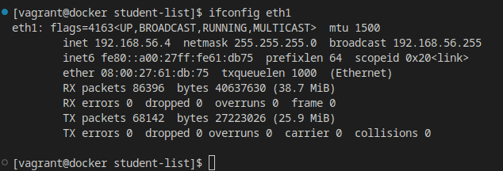
</div><br/>

Test à partir du navigateur

<div>
  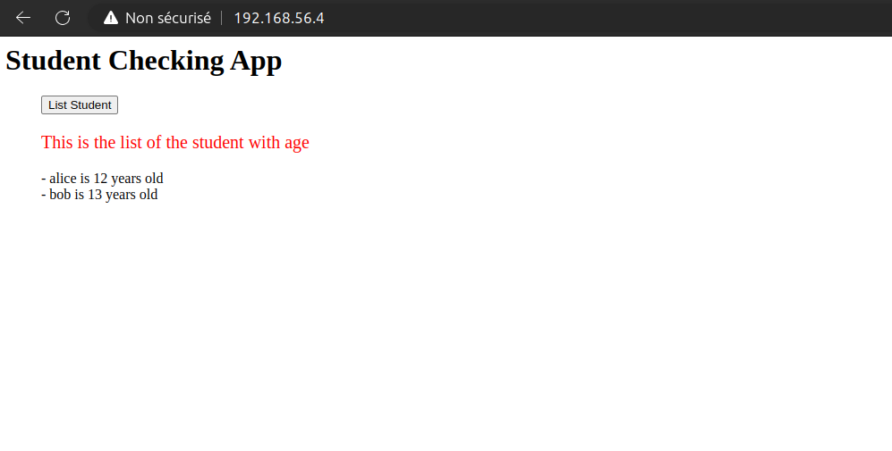
</div><br/>

## 7 - Mise en place du registre privé

Nous allons procéder à la mise en place de registre prive en utilisant:

**registry:2** comme image du registre, et **joxit/docker-registry-ui:static** comme image du frontend

*production du docker compose du registre privé*

```
version: '3.3'
services:
  pozos-registry:
    image: registry:2.8.1
    container_name: pozos-registry
    restart: always
    ports: 
      - "5000:5000"
    volumes:
      - /opt/docker/registry:/var/lib/registry
      - ./registry/auth:/auth
    environment:
      - REGISTRY_STORAGE_DELETE_ENABLED=true
      - REGISTRY_AUTH=htpasswd
      - REGISTRY_AUTH_HTPASSWD_REALM=Registry Realm
      - REGISTRY_AUTH_HTPASSWD_PATH=/auth/htpasswd
    command:
      - /bin/sh
      - -c
      - 'apk add --no-cache apache2-utils && htpasswd -Bbn pozos pozos > /auth/htpasswd && registry serve /etc/docker/registry/config.yml'
    networks:
      - pozos-registry-network

  frontend-registry:
    image: joxit/docker-registry-ui:2
    container_name: frontend-registry
    depends_on:
      - pozos-registry
    ports: 
      - "8080:80"
    environment:
      - NGINX_PROXY_PASS_URL=http://pozos-registry:5000
      - DELETE_IMAGES=true
      - REGISTRY_TITLE=Pozos
      - SINGLE_REGISTRY=true
    networks:
      - pozos-registry-network

networks:
  pozos-registry-network:
```

**Déploiement du registre**

```
docker-compose -f registre.yml up -d

docker ps
```
<div>
  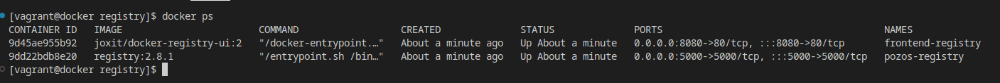
</div><br/>


à partir du navigateur
<div>
  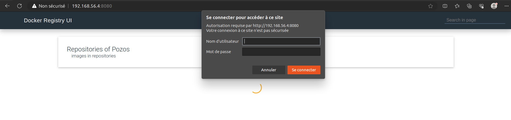
</div><br/>

**Login au registre**
```
docker login -u pozos -p pozos http://localhost:8080/
```
<div>
  
</div><br/>

**Tag et push de l'image**

```
docker tag api-student-list localhost:8080/api-student-list
docker push localhost:8080/api-student-list
```
<div>
  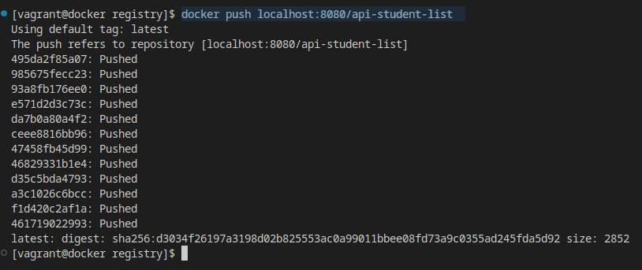
</div><br/>

**Vérification**

<div>
  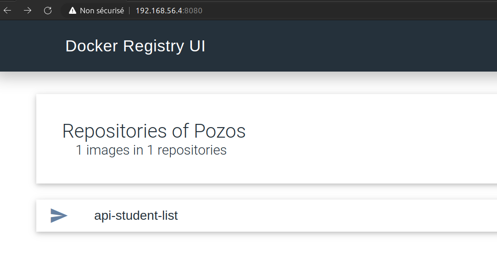
</div><br/>

<div>
  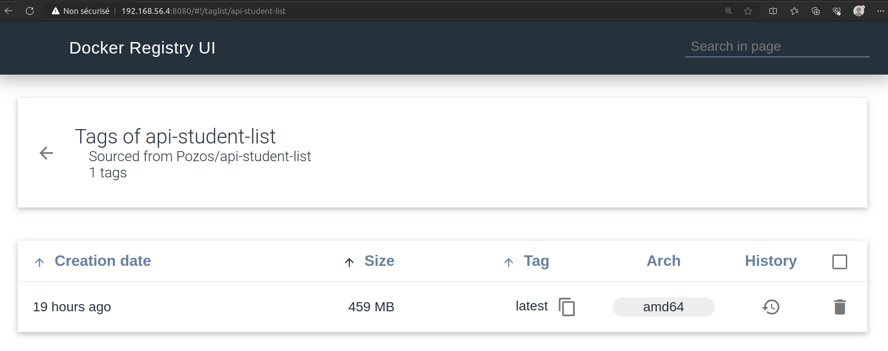
</div><br/>

## Conclusion
## Authors

- [@octokatherine](https://www.github.com/octokatherine)

